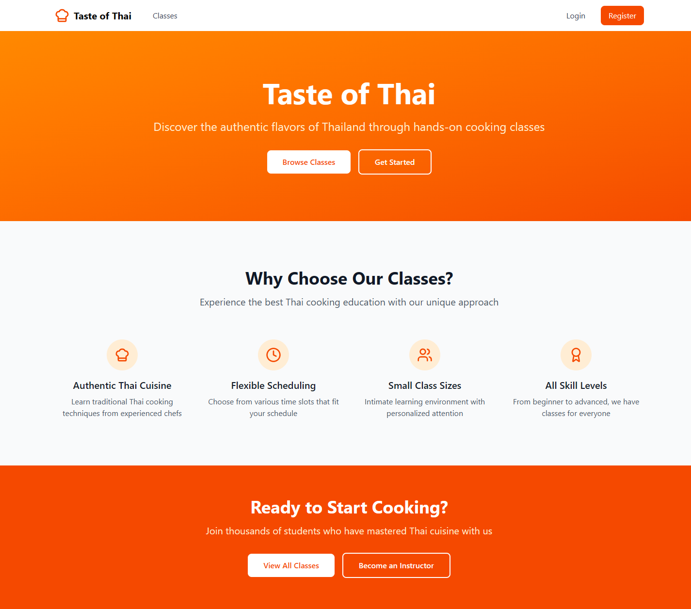
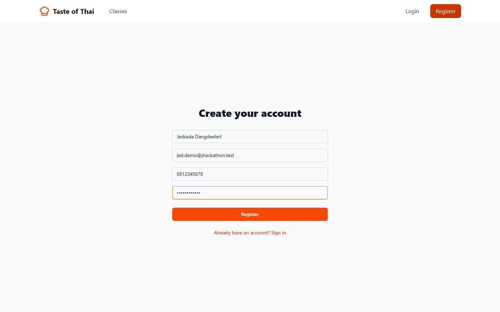
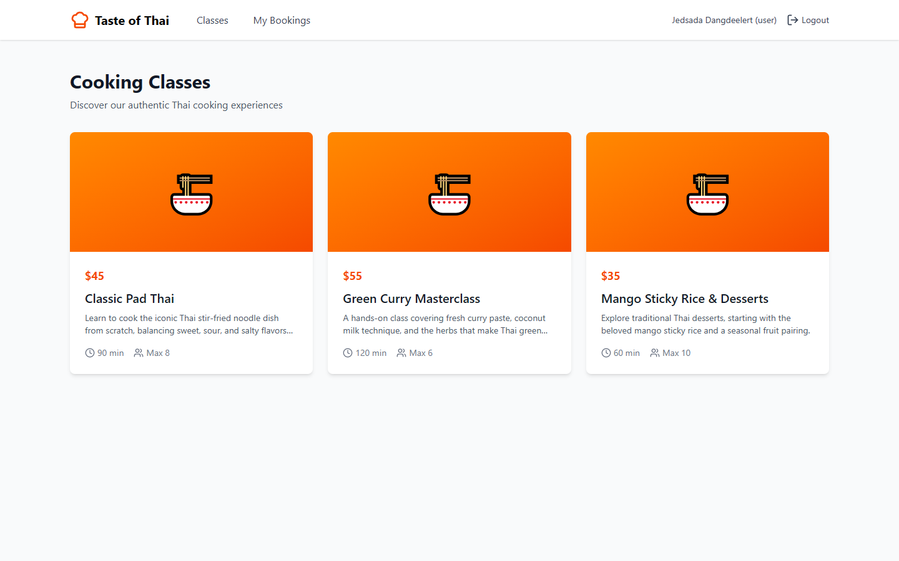
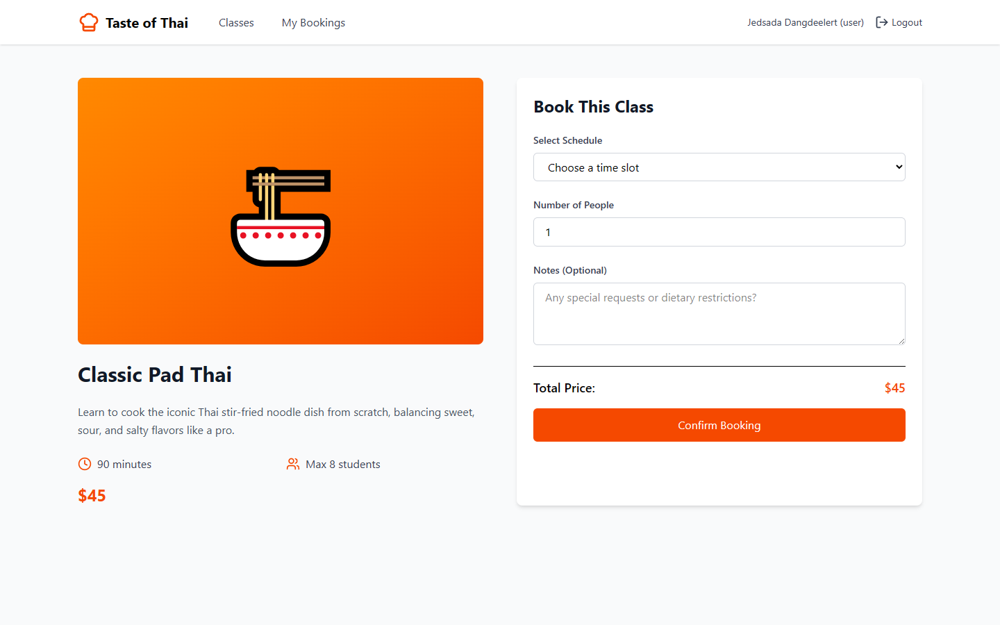
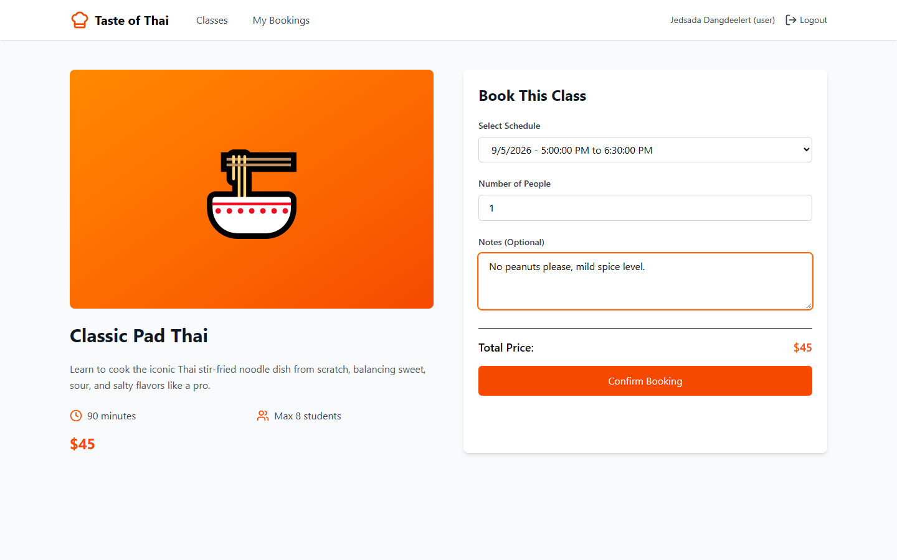
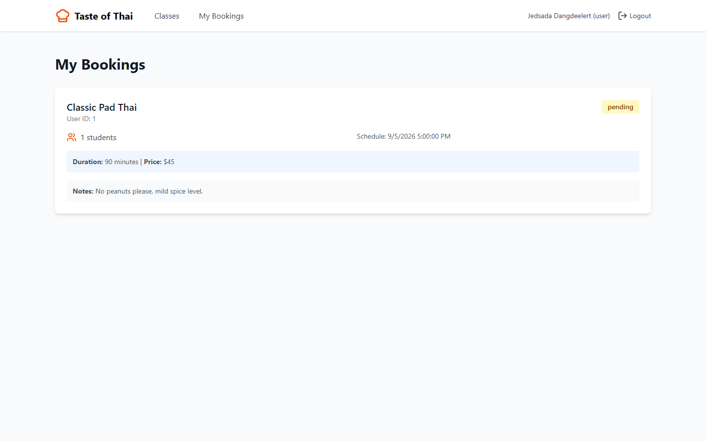
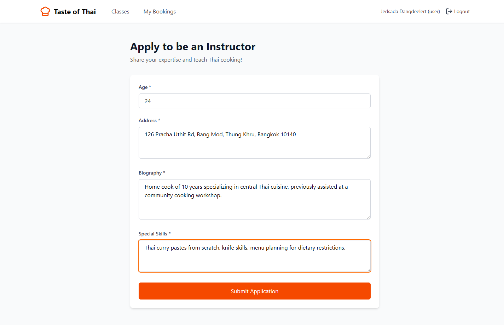

# JHackathon — Class Booking Platform

A web platform for browsing and booking classes, with a staff-application flow
for instructors and an admin panel for managing classes, staff, and bookings.
Built during a hackathon.

---

## Features

- 🔐 User authentication (register / login)
- 📚 Browse available classes and view class details
- 📅 Book a class and view "My Bookings"
- 🧑‍🏫 Staff application flow — users can apply to become instructors; staff
  status is tracked (pending / accepted / rejected)
- 🛠️ Admin panel for managing classes, staff, and schedules
- 💬 In-app chat

## Tech Stack

**Frontend**
- React 19 + Vite + TypeScript
- Tailwind CSS 4
- TanStack Query (data fetching / caching)
- React Router
- shadcn-style components (class-variance-authority, tailwind-merge)
- Lucide icons

**Backend**
- Express 5 + TypeScript
- Supabase (Postgres + client SDK)
- JWT authentication
- bcrypt password hashing

## Project Structure

```
JHackathon/
├── frontend/
│   └── src/
│       ├── pages/
│       │   ├── HomePage.tsx
│       │   ├── ClassesPage.tsx
│       │   ├── ClassDetailPage.tsx
│       │   ├── MybookingsPage.tsx
│       │   ├── StaffApplicationPage.tsx
│       │   ├── LoginPage.tsx / RegisterPage.tsx
│       │   ├── admin/
│       │   └── staff/
│       ├── components/
│       └── lib/
└── backend/
    └── src/
        ├── routes/       # auth, class, booking, staff, apply, chat, schedule, user
        ├── controllers/
        ├── models/        # Supabase queries
        ├── middleware/
        └── config/
```

## Getting Started

### Backend

```bash
cd backend
cp .env.example .env   # fill in your Supabase project URL & keys
npm install
npm run dev
```

### Frontend

```bash
cd frontend
npm install
npm run dev
```

## My Role

I worked on the backend: the class/booking data layer, the staff application
CRUD flow (apply → pending → accepted/rejected), and user status updates on
application approval.

## Screenshots

Walkthrough of the main flow — register, browse classes, book a class, view "My Bookings", and apply to become an instructor.

> The real backend talks to a Supabase project owned by the team; these screenshots were captured against the real frontend running against a local mock API server that mirrors the same request/response shapes, since no Supabase credentials for this project were available for the walkthrough.

| | |
|---|---|
| **Home page** |  |
| **Register** |  |
| **Class listings** |  |
| **Class detail** |  |
| **Booking form** |  |
| **My Bookings** |  |
| **Staff application** |  |

## About the Project

Originally forked from [Waltzz62/JHackathon](https://github.com/Waltzz62/JHackathon)
as a team hackathon project. This copy reflects my own contributions pushed on
top of the shared codebase. For academic/portfolio purposes.
